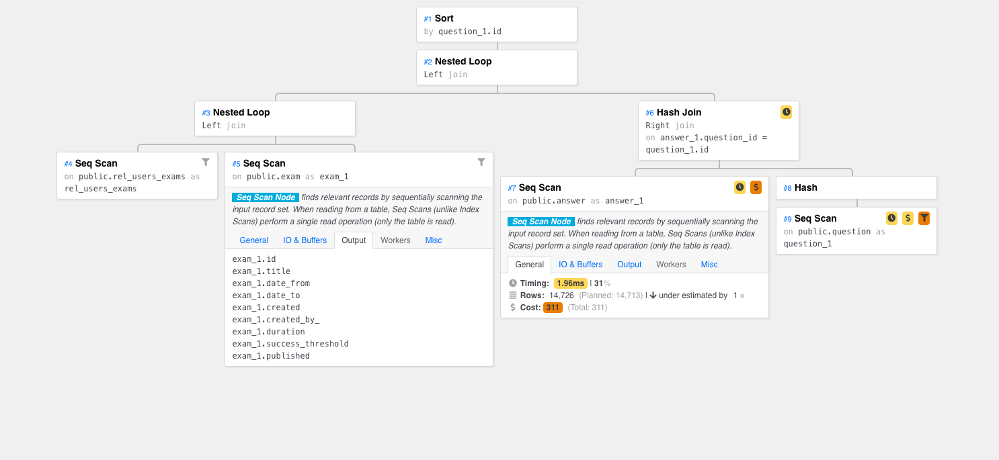

<!--
This is a template for TiDB's change proposal process, documented [here](./README.md).
-->

# RFC: <!-- Title --> TiVP - Visual Plan For TiDB

- Author(s): [@92hackers](https://github.com/92hackers), [@chrysan](https://github.com/chrysan), [@Tammyxia](https://github.com/Tammyxia), [@yiwen92](https://github.com/yiwen92) (in alphabetical order)
- Last updated: 2022-01-04 <!-- Date -->
- Discussion at: <!-- https://github.com/pingcap/tidb/issues/XXX -->
- Project at: https://github.com/yiwen92/TiDB-Hackathon-2021-TiVP

## 项目介绍

<!--
A short summary of the proposal:
- What is the issue that the proposal aims to solve?
- What needs to be done in this proposal?
- What is the impact of this proposal?
-->

TiVP is a Visual Plan for TiDB SQL explaination integreted with Dashboard.
该项目旨在可视化 TiDB 生成的执行计划。

## 背景&动机

<!--
An introduction of the necessary background and the problem being solved by the proposed change:
- The drawback of the current feature and the corresponding use case
- The expected outcome of this proposal.
-->

随着 TiDB 被运用到更加复杂的分析场景，SQL 语句会变得异常复杂，由此 explain 出来的执行计划（https://docs.pingcap.com/zh/tidb/stable/explain-walkthrough/#使用-explain-解读执行计划） 就会令人费解，影响性能调优效率。

当开发者对着 explain 生成的复杂执行计划抓耳挠腮的时候，我们更希望化繁为简，用可视化的方式将一条复杂 SQL 语句的执行流程清楚简明地展示出来，在帮助开发者快速了解 SQL Plan 执行计划的同时，给予优化的提示和帮助。

## 项目设计

<!--
A precise statement of the proposed change:
- The new named concepts and a set of metrics to be collected in this proposal (if applicable)
- The overview of the design.
- How it works?
- What needs to be changed to implement this design?
- What may be positively influenced by the proposed change?
- What may be negatively impacted by the proposed change?
-->

收集 TiDB 数据库侧 SQL 的执行计划和运行时信息，结构化定义执行计划信息，开发一个显示界面，用于图像化呈现 SQL 的执行计划，帮助技术人员更便捷地了解、分析 SQL 语句及其执行逻辑，从而快速定位以及解决执行计划相关的各类问题，如慢 SQL 优化、执行计划选错等。

主要功能：
- 收集和整理数据库侧必要信息，如执行计划（包括逻辑计划和物理计划）、各步骤运行耗时、访问信息（estRows 和 actRows）等
- 将执行计划的算子和代价通过树状结构进行可视化展现，明确显示耗时最长或代价最大的执行路径
- 集成于 TiDB 现有的管理工具 Dashboard，或以独立的可交互的展示界面就行演示

高级功能：
- Optimize Trace？呈现优化器生成计划的逻辑
- SQL 助手：智能 Hint 和改写？基于规则给予 SQL Hint 提示
- 统计信息可视化？帮助定位统计信息不准确问题

### Example

#### SQL 语句

```sql
SELECT rel_users_exams.user_username AS rel_users_exams_user_username,
       rel_users_exams.exam_id AS rel_users_exams_exam_id,
       rel_users_exams.started_at AS rel_users_exams_started_at,
       rel_users_exams.finished_at AS rel_users_exams_finished_at,
       answer_1.id AS answer_1_id,
       answer_1.text AS answer_1_text,
       answer_1.correct AS answer_1_correct,
       answer_1.fraction AS answer_1_fraction,
       answer_1.question_id AS answer_1_question_id,
       question_1.id AS question_1_id,
       question_1.title AS question_1_title,
       question_1.text AS question_1_text,
       question_1.file AS question_1_file,
       question_1.type AS question_1_type,
       question_1.source AS question_1_source,
       question_1.exam_id AS question_1_exam_id,
       exam_1.id AS exam_1_id,
       exam_1.title AS exam_1_title,
       exam_1.date_from AS exam_1_date_from,
       exam_1.date_to AS exam_1_date_to,
       exam_1.created AS exam_1_created,
       exam_1.created_by_ AS exam_1_created_by_,
       exam_1.duration AS exam_1_duration,
       exam_1.success_threshold AS exam_1_success_threshold,
       exam_1.published AS exam_1_published
FROM rel_users_exams LEFT OUTER
JOIN exam AS exam_1
    ON exam_1.id = rel_users_exams.exam_id LEFT OUTER
JOIN question AS question_1
    ON exam_1.id = question_1.exam_id LEFT OUTER
JOIN answer AS answer_1
    ON question_1.id = answer_1.question_id
WHERE rel_users_exams.user_username = %(param_1)s
        AND rel_users_exams.exam_id = %(param_2)s
ORDER BY  question_1.id;
```

#### 对应的可视化渲染结果（效果模拟图）



## Rationale

<!--
A discussion of alternate approaches and the trade-offs, advantages, and disadvantages of the specified approach:
- How other systems solve the same issue?
- What other designs have been considered and what are their disadvantages?
- What is the advantage of this design compared with other designs?
- What is the disadvantage of this design?
- What is the impact of not doing this?
-->
这是第一套针对 TiDB 执行计划进行图形展示的项目，我们会根据现有 TiDB 执行计划内容做相应适配和整理工作；
独立的 UI 会更加灵活地实现我们想展示的风格和交互形式；与 TiDB Dashboard 做集成则有方便易用，自动部署，官方维护，风格统一的好处。


## Compatibility and Migration Plan

<!--
A discussion of the change with regard to the compatibility issues:
- Does this proposal make TiDB not compatible with the old versions?
- Does this proposal make TiDB not compatible with TiDB tools?
    + [BR](https://github.com/pingcap/br)
    + [DM](https://github.com/pingcap/dm)
    + [Dumpling](https://github.com/pingcap/dumpling)
    + [TiCDC](https://github.com/pingcap/ticdc)
    + [TiDB Binlog](https://github.com/pingcap/tidb-binlog)
    + [TiDB Lightning](https://github.com/pingcap/tidb-lightning)
- If the existing behavior will be changed, how will we phase out the older behavior?
- Does this proposal make TiDB more compatible with MySQL?
- What is the impact(if any) on the data migration:
    + from MySQL to TiDB
    + from TiDB to MySQL
    + from old TiDB cluster to new TiDB cluster
-->
无。

## Implementation

<!--
A detailed description for each step in the implementation:
- Does any former steps block this step?
- Who will do it?
- When to do it?
- How long it takes to accomplish it?
-->
使用 `EXPLAIN` SQL 语句可查看 TiDB 执行某条语句时选用的执行计划，后端服务会将生成的执行计划结果格式化为 JSON 格式的数据, 通过接口返回给 Dashboard 前端。
Dashboard 前端解析返回的 JSON 数据，根据预设的字段类型和和图表的映射关系，渲染为图表。

[@92hackers](https://github.com/92hackers) focus on frontend

[@chrysan](https://github.com/chrysan) focus on backend

[@Tammyxia](https://github.com/Tammyxia) focus on testing

[@yiwen92](https://github.com/yiwen92) focus on project

1st meeting note: Setup team, Sync-up idea

Task:
Preparation & investigation
RFC draft
Repo setup

2nd meeting note：framework discussion, responsibility division

Task:
Frontend work & Backend work
RFC commit & Org setup
Presenting initial


## Testing Plan

<!--
A brief description on how the implementation will be tested. Both integration test and unit test should consider the following things:
- How to ensure that the implementation works as expected?
- How will we know nothing broke?
-->
演示。

## Open issues (if applicable)

<!--
A discussion of issues relating to this proposal for which the author does not know the solution. This section may be omitted if there are none.
-->
无。
